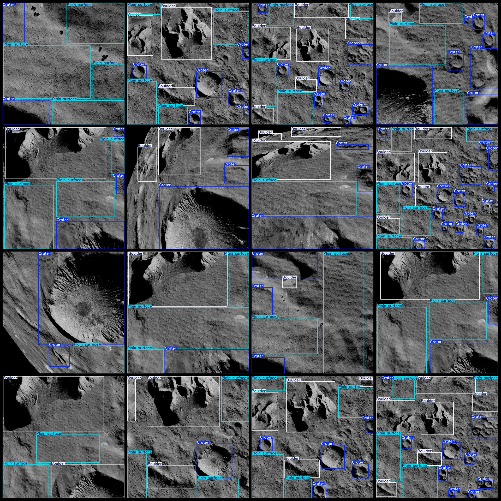
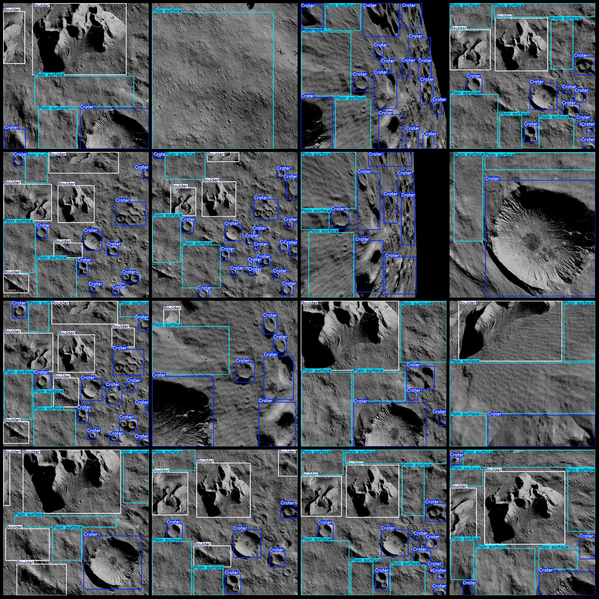

# High-Resolution Imagery of the Moon, Mars, and Rocky Craters Detection Dataset (VOC+YOLO format: 4322 images in 3 categories)

Please note that the dataset is extracted from video frames, so it may appear to have continuous scenes. Please carefully review the images.

The dataset follows the Pascal VOC format plus YOLO format (excluding the segmentation path's txt file, only including JPG images along with their corresponding VOC XML files and YOLO txt files).

Number of image files (in JPG format): 4322
Number of annotation files (in XML format): 4322
Number of annotation files (in txt format): 4322
Number of annotation categories: 3
Annotation category names (note that the order of categories in the YOLO format does not match this, but is based on the labels folder's classes.txt): ["Boulder", "Crater", "Plain surface"]
Each category has a specified number of bounding boxes:
- Boulder (large rock) bounding box count = 7764
- Crate (crater) bounding box count = 23985
- Plain surface (plain surface) bounding box count = 12393
Total bounding box count: 44142
Image resolution: 1024x1024
Annotation tools used: labelImg
Annotation rules: Drawing bounding boxes for each category
Important notice: The dataset does not include any partitions for training, validation, or testing. You will need to divide them yourself.
Special declaration: This dataset does not guarantee the accuracy of the trained models or weights files.
Image preview:

## Images

Here is a pay link on Stripe ( https://buy.stripe.com/3cs8yP7sY87d0vu9AB ). Please contact me lonlonago@foxmail.com after funding $89, and I will send you a complete data files , thank you!

